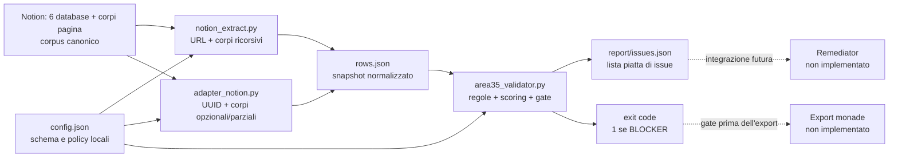
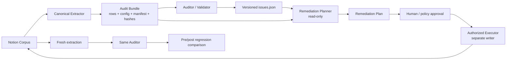

# GMV Remediator Architecture Alignment Review

**Progetto:** GMV Core / `area35-qa`  
**Data revisione:** 18 agosto 2026  
**Tipo di revisione:** architetturale, read-only sul codice e sui dati sorgente  
**Esito sintetico:** **allineamento parziale; contratto non ancora tecnicamente implementabile in sicurezza**  
**Remediator:** non sviluppato e non esistente nel sistema osservato

## 1. Executive summary

L'idea di fondo del contratto è corretta: separare diagnosi, pianificazione, autorizzazione, applicazione e nuovo audit; impedire la creazione di conoscenza non supportata; conservare provenienza e non regressione.

L'architettura reale, però, non contiene i componenti separati chiamati “GMV Auditor”, “GMV Audit Report / Issue System” e “Validator”. Esiste un unico modulo, `area35_validator.py`, che carica il corpus normalizzato, esegue tutte le regole, costruisce le issue, calcola il gate e serializza `issues.json`. L'“Issue System” è un dataclass e un `json.dump`, non un sottosistema autonomo. Il corpus canonico è Notion; `rows.json` è soltanto uno snapshot normalizzato.

La revisione ha inoltre identificato quattro bloccanti architetturali prima di qualsiasi sviluppo del Remediator:

1. Il contratto richiede `issues.json` come input esclusivo, ma lo schema reale non contiene valore corrente, percorso tecnico della proprietà, versione dello snapshot, hash, run ID, configurazione usata o identificatore stabile dell'issue. Non basta per costruire o applicare patch tracciabili senza rileggere `rows.json` e `config.json`.
2. I due estrattori producono identità incompatibili: `notion_extract.py` produce URL Notion, mentre `adapter_notion.py` produce UUID. L'attuale `rows.json` usa UUID; `report-complete/issues.json`, citato nella pagina Notion, usa URL. Nessuno dei 168 `record_id` non globali del report “complete” è collegabile direttamente agli ID dell'attuale `rows.json`.
3. Il repository GitHub `GMVrgb76/gmv-core-notion-pipeline` è allineato al checkout locale al commit `8b722c984201f9a933b9b1d2a3613494cb07e7ad` (`main`, tag `v0.1`), ma pubblica solo codice e README. `config.json`, fixture, snapshot e report sono esclusi da `.gitignore`; il contratto Remediator è non tracciato. La release non è quindi riproducibile dal solo contenuto GitHub.
4. Esistono output concorrenti senza manifest di esecuzione: l'attuale `report/issues.json` contiene 172 issue; `report-complete/issues.json` ne contiene 442. Entrambi hanno 11 BLOCKER, 63 MAJOR e 20 INFO, ma i MINOR sono rispettivamente 78 e 348, soprattutto per la diversa estrazione del corpo e per Q07. Non esiste un legame formale che dichiari quale report appartiene a quale snapshot/config/commit.

**Decisione raccomandata:** non avviare lo sviluppo del Remediator finché non vengono congelati un solo contratto di estrazione e identità, uno schema versionato per gli artefatti e un audit bundle immutabile. Queste sono correzioni di contratto e governance, non sviluppo del Remediator.

## 2. Fonti e baseline osservata

| Fonte | Evidenza osservata | Stato |
|---|---|---|
| GitHub remote | `git@github.com:GMVrgb76/gmv-core-notion-pipeline.git`; `refs/heads/main` e tag dereferenziato `v0.1` → `8b722c9…` | Verificato live il 18 agosto 2026 con `git ls-remote` |
| Checkout locale `area35-qa` | `HEAD`, `origin/main` e `v0.1` sullo stesso commit; contratto Remediator non tracciato | Allineato per i file tracciati |
| Repository padre GMV Core | `area35-qa/` appare non tracciato nel repository padre; il sottoprogetto ha un proprio `.git` | Confine di repository separato |
| Notion progetto | [Area35 QA — Stato di fatto e punto decisionale](https://app.notion.com/p/3bc5a429a02881b79c05d7fb87867481) | Pagina recuperata nella revisione; dichiara 178 schede e gate bloccato |
| Notion live | Sei database/data source; conteggi 15 artisti, 29 mostre, 21 persone, 18 istituzioni, 83 opere, 12 sponsor | 178 record complessivi, verificati live il 18 agosto 2026 |
| Artefatti locali attuali | `rows.json` + `report/issues.json` | Riproducibili byte-per-byte con il validatore corrente |

La pagina Notion descrive correttamente il flusso generale, i sei database, i 178 record, gli 11 BLOCKER e il gate bloccato. Distingue inoltre correttamente il successo tecnico del software dalla qualità insufficiente dei dati. La live inspection conferma che i conteggi e i principali nomi di schema sono ancora coerenti con la pagina e con `config.json`.

## 3. Struttura reale del sistema

### 3.1 Componenti presenti

| Componente reale | Responsabilità effettiva | Stato GitHub v0.1 |
|---|---|---|
| Sei database Notion | Corpus canonico operativo: proprietà, relazioni e corpi pagina | Esterno al repository |
| `config.json` | Mappa schema Notion → modello normalizzato; definisce entità, campi, relazioni, regole di servizio, lessici, soglie e mapping epistemico | Locale, escluso da Git |
| `notion_extract.py` | Estrattore REST read-only; interroga data source/database, risolve ID e relazioni in URL Notion, legge ricorsivamente i corpi pagina, scrive `rows.json` | Tracciato |
| `adapter_notion.py` | Secondo estrattore REST read-only; interroga i database, mantiene UUID, legge corpi solo con `--with-bodies` e solo per entità abilitate, scrive `rows.json` | Tracciato |
| `rows.json` | Snapshot normalizzato del corpus Notion, input del validatore; non è il corpus canonico | Locale, escluso da Git |
| `area35_validator.py` | Loader, motore di regole, calcolo punteggi/exportability, gate BLOCKER e serializzazione delle issue | Tracciato |
| `report/issues.json` | Lista piatta delle issue dell'esecuzione corrente | Locale, escluso da Git |
| `run_area35_qa.sh` | Orchestratore CLI: estrazione opzionale con `notion_extract.py`, poi validazione | Tracciato |
| `README.md` | Documentazione d'uso e descrizione del modello | Tracciato |
| `GMV_REMEDIATOR_CONTRACT.md` | Specifica concettuale proposta per un componente futuro | Locale, non tracciato |
| Export monade | Dichiarato esplicitamente fuori dal launcher | Non presente |
| Remediator / writer Notion | Nessun modulo, servizio o adapter di scrittura | Non presente |

Non sono presenti import o dipendenze verso i package del repository padre `gmv_core`. `area35-qa` è quindi oggi un sottoprogetto autonomo annidato nel filesystem di GMV Core, non un modulo integrato nel runtime GMV Core.

### 3.2 Flusso dati reale completo



Flusso osservato e riprodotto sull'artefatto corrente:

1. Notion conserva i record canonici e i corpi pagina.
2. Un estrattore legge Notion e normalizza i dati in `rows.json`.
3. Il validatore carica ogni riga in `Record`, applica sette famiglie di regole (`S`, `R`, `T`, `M`, `Q`, `D`, `N`), ordina le issue e calcola la completezza/esportabilità.
4. Il runner scrive una lista JSON in `report/issues.json` e restituisce exit code `1` quando esiste almeno un BLOCKER.
5. Non esiste alcuna fase di remediation, approvazione, scrittura su Notion, confronto pre/post o export monade.

## 4. Mappa terminologica

| Termine concettuale | Implementazione reale | Valutazione |
|---|---|---|
| **Auditor** | Principalmente `area35_validator.py`: `REGOLE`, `esegui()`, `punteggi()` e `main()` | Funzione presente, nome/modulo “Auditor” assente |
| **Issue System / Audit Report** | `Issue` dataclass, helper `_iss()`, lista in memoria e `json.dump` dentro `area35_validator.py` | Non è un componente separato; nessun repository, lifecycle o stable issue ID |
| **Validator** | Lo stesso `area35_validator.py`; il launcher lo esegue come gate | Coincide con l'Auditor reale; non esiste un secondo validatore post-remediation |
| **Corpus** | I sei database Notion e i corpi pagina sono il corpus canonico; `rows.json` è una sua proiezione/snapshot | Il contratto deve distinguere source corpus e audit snapshot |
| **Remediator** | Nessuna implementazione. Esiste solo `GMV_REMEDIATOR_CONTRACT.md` non tracciato | Assente |
| **Executor / writer** | Nessun componente di scrittura Notion | Assente ma necessario per una futura modalità Applicazione |
| **Orchestrator** | `run_area35_qa.sh` | Presente, ma copre solo extract + validate |

Terminologia raccomandata:

- **Notion Corpus**: i sei data source e i corpi pagina.
- **Extractor / Normalizer**: un solo adapter canonico che produce lo snapshot.
- **Audit Snapshot**: `rows.json`, immutabile e identificato da hash.
- **Auditor / Validator**: il modulo corrente `area35_validator.py`; scegliere un solo nome pubblico.
- **Audit Report**: `issues.json` più un manifest di esecuzione; non chiamarlo “Issue System” finché non esiste un lifecycle persistente.
- **Remediation Planner**: futuro componente read-only che classifica e propone.
- **Authorized Executor**: futuro adapter separato che applica solo piani approvati.
- **Regression Validator**: nuova esecuzione dello stesso Auditor su un nuovo snapshot, più confronto pre/post.

## 5. Verifica del contratto Remediator

### 5.1 Parti corrette

Sono architetturalmente corrette e coerenti con il progetto:

- separazione tra diagnosi e remediation;
- divieto di inventare dati o contenuti curatoriali;
- categorie `AUTO_FIX`, `RESEARCH_REQUIRED`, `HUMAN_DECISION`, `SCHEMA_CHANGE`;
- modalità Analisi senza scritture e Applicazione autorizzata;
- obbligo di conservare stato precedente/successivo, motivazione, fonte/regola e autore;
- nuova esecuzione dell'Auditor dopo ogni intervento;
- controllo sia della scomparsa del problema sia dell'assenza di regressioni;
- mantenimento dell'operatore umano per decisioni editoriali e curatoriale.

Questi principi sono compatibili anche con il limite dichiarato dal validatore: il sistema misura rischio e coerenza, non la verità dei fatti.

### 5.2 Parti concettuali che non corrispondono ai moduli reali

| Affermazione del contratto | Realtà osservata | Correzione suggerita |
|---|---|---|
| Esistono due componenti precedenti, “GMV Auditor” e “GMV Audit Report / Issue System” | Entrambe le funzioni sono nello stesso file `area35_validator.py` | Descrivere funzioni logiche, non moduli inesistenti |
| “Validazione” è una responsabilità separata | Il validatore è l'Auditor stesso | Specificare “riesecuzione dello stesso Auditor + comparatore pre/post” |
| Input esclusivo: `issues.json` | Lo schema non contiene abbastanza contesto per una patch sicura | Usare un audit bundle versionato oppure arricchire le issue |
| L'Auditor classifica i problemi | Produce codice, severità e testo d'azione; non produce la classificazione Remediator | Assegnare `action_class` al Planner tramite una policy versionata, senza confonderla con severità |
| Il Remediator applica regole | Non esiste un writer né un protocollo di autorizzazione machine-readable | Separare Planner ed Executor e definire capability/approval envelope |
| “Corpus” è implicitamente l'input dell'Auditor | Il corpus canonico è Notion; `rows.json` è uno snapshot | Nominare esplicitamente entrambi e vietare patch su snapshot come sostituto della fonte |
| Estensione naturale di GMV Core | Il progetto è un repository Git autonomo annidato e senza import GMV Core | Definire il confine di integrazione prima dello sviluppo |
| Continuità con formati già prodotti | Esistono due formati di identità e report concorrenti | Congelare un formato canonico versionato |

L'affermazione narrativa secondo cui i componenti sarebbero stati sviluppati da “Claude Code” non è verificabile dal repository e non deve comparire come premessa tecnica o requisito architetturale.

### 5.3 Correzioni proposte al contratto

Prima dell'implementazione, correggere il contratto in questo modo:

1. Sostituire “due componenti precedenti” con “un pipeline extract/normalize/audit, nel quale il modulo `area35_validator.py` incorpora motore di audit, issue emission e gate”.
2. Sostituire l'input esclusivo `issues.json` con un **Audit Bundle** immutabile:
   - `rows.json` o riferimento immutabile + SHA-256;
   - `issues.json` + SHA-256;
   - `config.json` + SHA-256;
   - commit/tag dell'Auditor;
   - `run_id`, timestamp UTC, extractor ID/version, schema version;
   - source watermark/snapshot time di Notion.
3. Stabilire un solo identificatore canonico di record. Raccomandazione: URL Notion canonico nell'interfaccia esterna, con UUID normalizzato disponibile separatamente come `source_page_id`.
4. Definire uno schema versionato per le issue e aggiungere almeno: `schema_version`, `issue_id`/fingerprint, `run_id`, `rule_id` + versione, `record_ref`, `field_path`, `observed_value` o evidence reference, `suggested_action`, `diagnostic_only`.
5. Separare **Remediation Planner** da **Authorized Executor**. Il primo non scrive; il secondo accetta solo un piano approvato e firmato/identificato.
6. Rendere l'autorizzazione machine-readable: approvatore, timestamp, scope, action IDs, scadenza, modalità dry-run/apply.
7. Definire optimistic concurrency per Notion: prima di scrivere, verificare `last_edited_time`/versione osservata per evitare patch su dati cambiati dopo l'audit.
8. Definire il confronto di non regressione per stable issue fingerprint, non solo per conteggi aggregati.
9. Dichiarare che `SCHEMA_CHANGE` produce esclusivamente una proposta e non può raggiungere l'Executor senza un'approvazione distinta.
10. Versionare il contratto nello stesso repository dell'interfaccia che governa, oppure dichiarare esplicitamente un repository/spec authority esterna.

## 6. Verifica tecnica degli schemi reali

### 6.1 `rows.json`

Non esiste un JSON Schema formale. Il loader è permissivo: se mancano `id`, `titolo`, `campi`, `relazioni`, `servizio` o `corpo`, applica fallback/default e non rifiuta la riga. Lo schema de facto è:

```text
object {
  <entity>: array<{
    id: string,
    titolo: string,
    campi: object<string, string | number | array | null>,
    relazioni: object<string, array<string>>,
    servizio: object<string, string | boolean | number | null>,
    corpo?: string
  }>
}
```

Chiavi root attuali: `artista`, `istituzione`, `mostra`, `opera`, `persona`, `sponsor`.

| Entità | N | `campi` | `relazioni` | `servizio` |
|---|---:|---|---|---|
| artista | 15 | `nome`, `anno_nascita`, `luogo_nascita`, `nazionalita` | `mostre`, `opere`, `persone_collegate`, `istituzioni`, `sponsor` | `stato`, `pubblicabile` |
| mostra | 29 | `titolo`, `data`, `tipologia`, `curatela`, `sede`, `citta`, `paese` | `artisti`, `istituzioni`, `opere`, `persone`, `sponsor` | `stato`, `data_end`, `fonte::Fonte Dropbox`, `pubblicabile` |
| persona | 21 | `nome_completo`, `cognome`, `ruolo`, `affiliazione`, `significato`, `paese` | `mostre`, `artisti`, `istituzioni`, `opere`, `sponsor` | `stato`, `verificato_il`, `fonte::Riferimento esterno` |
| istituzione | 18 | `nome`, `tipologia`, `citta`, `paese`, `significato` | `mostre`, `artisti`, `persone_collegate`, `sponsor` | `stato`, `verificato_il`, `fonte::Sito ufficiale`, `pubblicabile` |
| opera | 83 | `titolo`, `anno`, `datazione`, `tecnica`, `dimensioni`, `serie` | `artista`, `mostre`, `persone_collegate` | `stato`, due campi `fonte::*`, `pubblicabile` |
| sponsor | 12 | `titolo`, `tipo_soggetto`, `tipo_contrib`, `descrizione`, `valore` | `mostre`, `istituzioni`, `artisti`, `persone` | `stato`, `verificato_il`, `fonte::Fonte primaria`, `pubblicabile`, `riservatezza` |

Dettagli importanti dello snapshot corrente:

- tutti i 178 `id` e i 594 riferimenti di relazione sono UUID Notion, non URL;
- `corpo` è presente per artista, mostra, persona e istituzione; è assente per opera e sponsor;
- `anno_nascita` è numerico; `opera.anno` è `number | null`; i multi-select sono array;
- `pubblicabile` è attualmente serializzato come stringa `__YES__`/`__NO__` dall'adapter che ha prodotto lo snapshot; l'altro estrattore può serializzarlo come booleano;
- le chiavi fonte incorporano il nome della property Notion (`fonte::<Nome property>`), rendendo il contratto dipendente dalla terminologia dello schema sorgente.

La frase del README e della pagina Notion secondo cui ID e relazioni sono URL descrive solo l'output di `notion_extract.py`, non lo snapshot corrente prodotto dall'altro adapter.

### 6.2 `report/issues.json`

Lo schema reale è una **lista JSON piatta**, senza envelope o metadati di run:

```text
array<{
  codice: string,
  severita: "BLOCKER" | "MAJOR" | "MINOR" | "INFO",
  entita: string,
  record_id: string,
  titolo: string,
  campo: string,
  messaggio: string,
  azione: string
}>
```

Tutti gli otto campi sono serializzati come stringhe. Le issue globali di corpus usano `record_id: "-"` e `campo: "-"`. `azione` può essere vuota: 80 delle 172 issue correnti non hanno un'azione valorizzata.

Esecuzione corrente riprodotta:

| Metrica | Valore |
|---|---:|
| Schede | 178 |
| Esportabili | 162 |
| Issue totali | 172 |
| BLOCKER | 11 |
| MAJOR | 63 |
| MINOR | 78 |
| INFO | 20 |
| Exit code | 1 |
| SHA-256 `report/issues.json` | `0df50bd54a3b25f8ead93fbc26cef2f3a2c7594bfeb02f87ff53da94f5a1ff20` |

La riesecuzione in directory temporanea ha prodotto lo stesso hash del report corrente. I 90 `record_id` unici non globali del report corrente sono tutti risolvibili nello snapshot corrente.

Limiti per il Remediator:

- nessun `schema_version`, `run_id`, timestamp o hash dello snapshot;
- nessun stable `issue_id`;
- nessun valore osservato/pre-change;
- `campo` è talvolta una chiave normalizzata (`anno`), talvolta un nome Notion (`Pubblicabile`, `Fonte Dropbox`), talvolta `__corpo__` o `-`;
- `azione` è testo libero, non un comando tipizzato;
- nessuna distinzione tra issue diagnostica globale e issue correggibile salvo convenzioni implicite;
- nessun livello di autorizzazione;
- nessuna informazione di concorrenza/versione del record Notion.

### 6.3 Duplicazioni e conflitti

1. **Due estrattori concorrenti.** Hanno credenziali, endpoint, failure policy, formato ID e politica di lettura del corpo diversi.
2. **Due contratti di identità.** UUID nel current run; URL nel report “complete” e nella documentazione.
3. **Più report “completi”.** `report/issues.json` e `report-complete/issues.json` hanno lo stesso gate ma cardinalità MINOR diversa; manca un manifest.
4. **Issue semanticamente multiple.** Nel report corrente ci sono 10 gruppi con la stessa terna `(codice, record_id, campo)`, per 15 righe aggiuntive; il massimo è 3. Non sono necessariamente duplicati logici, ma senza fingerprint/evidence path il Remediator non può distinguerli stabilmente.
5. **Q07 amplifica il volume.** Il report storico contiene 300 Q07 contro 30 nel report corrente; l'algoritmo emette una issue per record e frase ricorrente, mentre la diversa profondità/ampiezza di estrazione del corpo modifica fortemente il risultato.
6. **Configurazione non versionata.** Il comportamento del validatore dipende in modo decisivo da `config.json`, ma GitHub non conserva la versione usata.
7. **Eccezioni delle regole assorbite.** `esegui()` stampa l'errore della singola regola e continua; il report non registra che l'audit è stato parziale. Un Remediator potrebbe quindi ricevere un report apparentemente valido ma incompleto.
8. **Failure parziale nell'adapter alternativo.** `adapter_notion.py` può continuare dopo l'errore di una singola entità e scrivere array vuoti, senza un failure manifest globale.

## 7. Punto corretto di integrazione del Remediator

Il punto corretto è **dopo la chiusura immutabile di un audit run e prima di qualsiasi writer**, non direttamente tra un file `issues.json` sciolto e Notion.



Il Planner deve poter leggere il contesto osservato, ma non reinterpretare liberamente il corpus per inventare una diagnosi. La diagnosi resta l'issue; `rows.json` serve a risolvere in modo deterministico record, valore e percorso della modifica. L'Executor deve essere separato e deve verificare autorizzazione e concorrenza prima di ogni write.

Per le issue attuali, una classificazione preliminare prudente è:

- `N01`, `N03`, `N04` → `SCHEMA_CHANGE` o decisione di modello; mai auto-fix;
- `M01`, `M02`, `M03`, `M07` → prevalentemente `RESEARCH_REQUIRED` o `HUMAN_DECISION`; rimozione di `Pubblicabile` può essere deterministica solo con una policy esplicitamente approvata;
- `Q01` → `HUMAN_DECISION` nel contenuto curatoriale; nessuna cancellazione automatica del testo;
- `Q02`, `Q03`, `Q07` → diagnostiche/editoriali, tipicamente `HUMAN_DECISION`;
- `S01` → `RESEARCH_REQUIRED` o `HUMAN_DECISION` secondo il campo;
- `R03` → richiede verifica della relazione e del modello; non auto-fix senza prova dell'inversa corretta;
- `AUTO_FIX` deve rimanere vuoto per default finché non esiste una regola deterministica, bidirezionalmente verificabile e autorizzata.

## 8. Allineamento tra GitHub, Notion e contratto

| Tema | GitHub v0.1 | Notion progetto/live | Contratto | Esito |
|---|---|---|---|---|
| Sei entità | Config non pubblicata, codice config-driven | Confermate live | Non dettagliate | Parzialmente allineato |
| 178 record | Artefatti esclusi | Confermati live e nella pagina | Non rilevante | Allineato sul dato osservato |
| Gate 11 BLOCKER | Algoritmo tracciato, report escluso | Dichiarato | Richiede nuovo audit | Concettualmente allineato |
| Identificatori | Due estrattori con output diverso | Pagina afferma URL | Presuppone continuità | Non allineato |
| Issue System | Integrato nel validator | Descritto come report | Trattato come componente separato | Non allineato nei nomi |
| Input Remediator | Schema issue minimale | Nessun bundle documentato | `issues.json` esclusivo | Non implementabile in sicurezza |
| Reproducibilità | Manca `config.json` nel repository | Pagina dichiara report riproducibile localmente | Richiede continuità | Locale sì, GitHub standalone no |
| Corpus | Non incluso | Notion è la fonte reale | Termine non precisato | Da correggere |
| Writer/apply | Assente | Nessuna autorizzazione a scrivere | Richiesto in futuro | Gap intenzionale ma non specificato |
| Remediator contract | Non tracciato | Non trovato come spec di progetto dedicata | File locale v0.1 | Authority non definita |

## 9. Raccomandazioni ordinate

### P0 — prerequisiti bloccanti

1. Congelare un unico estrattore canonico e ritirare/deprecare l'altro a livello di contratto.
2. Congelare il formato dell'identità e migrare/generare nuovamente snapshot e report coerenti.
3. Definire JSON Schema versionati per `rows.json` e `issues.json`.
4. Introdurre un audit manifest che leghi input, config, codice, estrattore e output tramite hash.
5. Correggere il contratto: il Remediator non può dipendere dal solo `issues.json` attuale.

### P1 — governance e riproducibilità

6. Versionare una configurazione riproducibile e priva di segreti, oppure pubblicarne schema e release artifact firmato.
7. Portare il contratto sotto controllo versione e dichiararne l'authority.
8. Rendere fatale o esplicito nel manifest qualsiasi errore di regola/estrazione parziale.
9. Definire Planner, approval envelope ed Executor come responsabilità distinte.
10. Definire optimistic concurrency e rollback/compensazione per future scritture Notion.

### P2 — qualità del report

11. Aggiungere stable issue fingerprint ed evidence locator.
12. Distinguere issue record-level, field-level e corpus-level.
13. Rendere `suggested_action` tipizzata o separarla dal messaggio umano.
14. Ridurre/aggregare Q07 oppure rappresentare separatamente finding e occorrenze.
15. Formalizzare il confronto pre/post e i criteri di non regressione.

## 10. Conclusione

Il sistema `area35-qa` funziona come pipeline read-only Notion → snapshot → audit → gate, e il current run è riproducibile. La documentazione Notion è sostanzialmente corretta sullo stato dei dati e sul blocco dell'export. GitHub è allineato al codice locale tracciato, ma non contiene la configurazione e gli artefatti necessari a riprodurre la release in autonomia.

Il contratto Remediator è valido come manifesto di sicurezza, ma descrive componenti che non esistono separatamente e assume un input insufficiente. Il corretto passo successivo non è sviluppare il Remediator: è consolidare l'interfaccia di audit, l'identità, gli schemi e la provenienza degli artefatti. Solo dopo tale consolidamento il Remediator potrà essere una naturale estensione controllata del sistema reale.

## Appendice A — riferimenti tecnici principali

- `README.md`: scopo, sei data source, regole e contratto dichiarato di `rows.json`.
- `notion_extract.py`: estrazione URL-oriented e corpi ricorsivi.
- `adapter_notion.py`: estrazione UUID-oriented e corpi opzionali/parziali.
- `area35_validator.py`: `Record`, `Issue`, regole, scoring, loader e serializer.
- `run_area35_qa.sh`: orchestrazione corrente.
- `config.json`: schema effettivo locale e policy del validatore, non versionato.
- `GMV_REMEDIATOR_CONTRACT.md`: contratto concettuale proposto, non versionato.
- [Area35 QA — Stato di fatto e punto decisionale](https://app.notion.com/p/3bc5a429a02881b79c05d7fb87867481): stato di progetto Notion usato nel confronto.

## Appendice B — modifiche eseguite durante la revisione

- Nessuna modifica al codice.
- Nessuna modifica ai database o alle pagine Notion.
- Nessuna modifica al repository GitHub.
- Nessuno sviluppo del Remediator.
- Creato esclusivamente questo documento di revisione.
